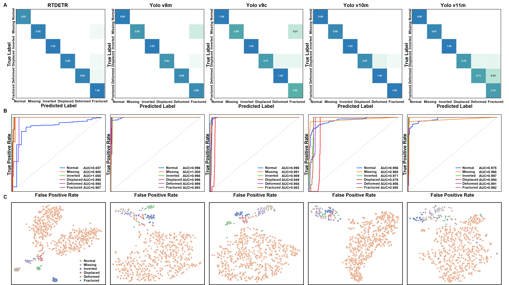

# RFDD: Railway Fastener Defect Dataset

[](https://opensource.org/licenses/MIT)
[](https://github.com/NIM-NMDC/RFDD)

**RFDD** is a high-fidelity, raw-scale dataset constructed for fine-grained fastener defect detection in high-speed railway systems. It features **pixel-level annotations** and strictly adheres to visual consistency principles to ensure engineering realism.

---

## 📊 Dataset Info

| Property | Description |
| :--- | :--- |
| **Resolution** | High-resolution ($2048 \times 2021$ pixels) |
| **Scale** | Raw, full-scene view (Multi-fastener layout) |
| **Total Images** | **1,350** (1,050 Train / 200 Val / 100 Test) |
| **Categories** | **6 Classes**: Normal, Missing, Reversed, Displaced, Deformed, Broken |
| **Format** | **HDF5** (Training/Val) & **PNG** (Testing) |
| **Annotation** | Pixel-level semantic masks & Bounding boxes |

> **Note**: The dataset construction is governed by 6 consistency principles: *Geometry, Optics, Boundary, Noise, Texture, and Hierarchy*.

---

## 🏆 Model Zoo & Benchmarks

We evaluated RFDD on 5 state-of-the-art detectors. The results demonstrate the dataset's high quality and the challenge it poses for precise localization.

### 1. Detection Performance
*Evaluated on the high-quality test set (100 images).*

| Method | mAP@0.5 | mAP@0.5:0.95 | Recall | Precision |
| :--- | :---: | :---: | :---: | :---: |
| **RT-DETR** | 0.9038 | 0.5996 | 0.9250 | 0.9435 |
| **YOLOv8m** | 0.9665 | 0.6517 | 0.9203 | 0.9348 |
| **YOLOv9c** | **0.9668** | 0.6796 | 0.8998 | 0.9503 |
| **YOLOv10m** | 0.9439 | 0.6730 | 0.9155 | **0.9598** |
| **YOLOv11m** | 0.9614 | **0.7106** | **0.9224** | 0.9218 |

### 2. Classification & Diagnostics
*Metrics derived from detection results to evaluate fault diagnosis reliability.*

| Method | Accuracy | Specificity | Sensitivity | F1-Score | Kappa |
| :--- | :---: | :---: | :---: | :---: | :---: |
| **RT-DETR** | 0.9766 | **0.9982** | 0.9499 | 0.9427 | 0.6483 |
| **YOLOv8m** | 0.9866 | 0.9718 | 0.8961 | 0.8957 | 0.8174 |
| **YOLOv9c** | 0.9850 | 0.9731 | 0.8477 | 0.8616 | 0.8020 |
| **YOLOv10m** | **0.9916** | 0.9797 | 0.9607 | **0.9407** | **0.8751** |
| **YOLOv11m** | 0.9847 | 0.9699 | 0.8634 | 0.8756 | 0.7943 |

---

## 📈 Visualization

The following figures illustrate the model behaviors and the feature discriminability of the RFDD dataset.


*Figure: (A) Confusion Matrices showing inter-class reliability. (B) ROC Curves demonstrating high sensitivity. (C) t-SNE visualization validating the distinct feature clustering of the 6 categories.*

---

## 📜 Citation

If you find RFDD useful for your research, please cite:

```bibtex
@article{RFDD2025,
  title={RFDD: A Full-Scene, High-Resolution Dataset for Fastener Defect Detection in High-Speed Railways},
  author={Bin Wang},
}
